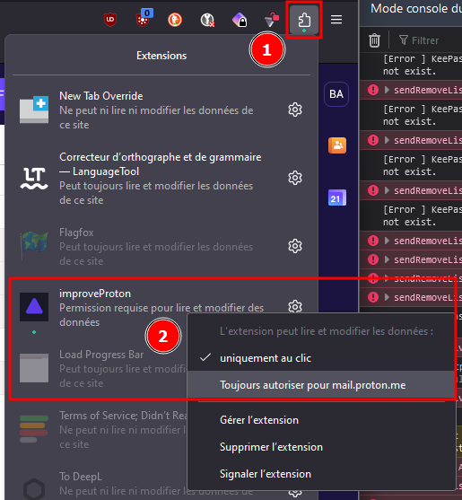

  

<h1 align="center">Improve Proton <i>- a firefox/chrome plugin</i></h1>

  

## Description

Remove 'get proton family' button and improve the placement of the mail label

### Main feature

- Remove 'get proton family' button
- Move the label just to the right of the sender name
- A setting page where you can choose to use one option, both or nothing at all
- The addon is only executed on the proton.me subdomain

### History

I always wanted to make a firefox extension for a long time and now I have two excuses for it:
- I pay proton and I'm not a fan of the "get a new plan" button everywhere because of it.
- As I use the label to sort my mail, I find it more readable to have the label just to the right of the sender's name.

## Installation

### Requirement

We just require the authorization to store the settings you choose into your sync storage via `storage.sync[set | get]`[^1].

Firefox needs a manual approval and chrome seems not.

### Firefox
- [Download the extension for Firefox](https://addons.mozilla.org/en-US/firefox/addon/improveproton/)
- Go to mail.proton.me or any other proton.me subdomain and authorize the addon

See the screenshot here for more details

### Chrome & Chrome based browser
- Since I need a developer account for chrome and the registration has a 5 dollar fee, I haven't put the addon on the store yet 
- At the moment, if you want to have this addon on chrome, you must download the latest version (see the latest zip file) [and follow these instructions](https://superuser.com/questions/247651/how-does-one-install-an-extension-for-chrome-browser-from-the-local-file-system).

## Configuration

| Name        | Description                                                     | Result                                      |
|-------------|-----------------------------------------------------------------|---------------------------------------------|
| Label       | If you want the label to the right of the sender's name check it | Move the label and set an observer          |
| Premium     | If you want the button to be removed check it                   | Set the style of the button to display=none |

## Code of conduct, license, authors, changelog, contributing

See the following files :
- [code of conduct](CODE_OF_CONDUCT.md)
- [license](LICENSE)
- [authors](AUTHORS)
- [contributing](CONTRIBUTING.md)
- [changelog](CHANGELOG)
- [security](SECURITY.md)

## Roadmap

- [done] ~~move the manifest to v3~~
- [done] ~~test & deploy on chrome~~

## Want to participate? Have a bug or a request feature?

Do not hesitate to open a pr or an issue. I will reply when I can.

## Want to support my work?

- [Give me a tip](https://ko-fi.com/a2n00)
- [Give a star on github](https://github.com/bouteillerAlan/improve-proton)
- [Give a five start on AMO](https://addons.mozilla.org/en-US/firefox/addon/improveproton/)
- Or just participate to the developement :D

### Thanks !

[^1]: [Documentation](https://developer.mozilla.org/en-US/docs/Mozilla/Add-ons/WebExtensions/API/storage/sync)
