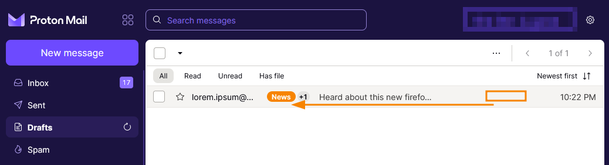
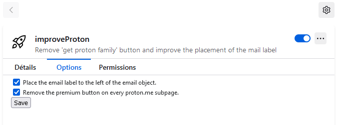

  

<h1 align="center">Improve Proton <i>- a firefox plugin</i></h1>

  

## Description

Remove 'get proton family' button and improve the placement of the mail label

### main feature

- Remove 'get proton family' button
- Move the label just to the right of the sender name
- A setting page where you can choose to use one option, both or nothing at all

### history

I've been wanting to make a firefox extension for a long time and now I have two excuses for it:
- I pay proton and I'm not a fan of the "get a new plans" button everywhere because of it.
- As I use the label to sort my mail, I find it more readable to have the label just to the right of the sender's name.

## Installation

- Download the extension and check the options (by default both of them are deactivated)

## Configuration

| Name        | Description                                                     | Result                                      |
|-------------|-----------------------------------------------------------------|---------------------------------------------|
| Label       | If you want the label to the right of the sender's name check it | Move the label and set an observer          |
| Premium     | If you want the button to be removed check it                   | Set the style of the button to display=none |

## Code of conduct, license, authors, changelog, contributing

See the following file :
- [code of conduct](CODE_OF_CONDUCT.md)
- [license](LICENSE)
- [authors](AUTHORS)
- [contributing](CONTRIBUTING.md)
- [changelog](CHANGELOG)
- [security](SECURITY.md)

## Roadmap

- nothing yet

## Want to participate? Have a bug or a request feature?

Do not hesitate to open a pr or an issue. I reply when I can.

## Want to support my work?

- [Give me a tips](https://ko-fi.com/a2n00)
- [Give a star on github](https://github.com/bouteillerAlan/improve-proton)
- Or just participate to the developement :D

### Thanks !
